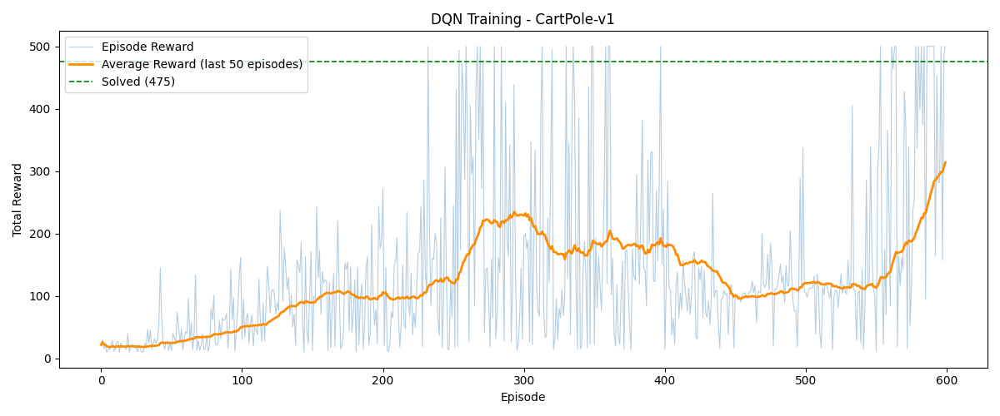
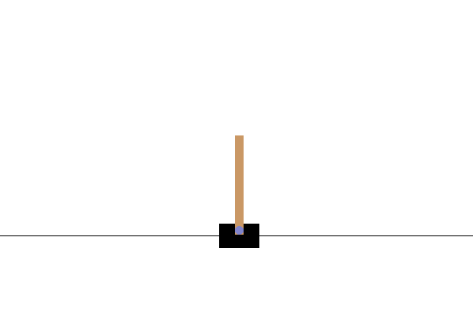

# 🤖 DQN CartPole

A clean, well-commented implementation of **Deep Q-Network (DQN)** applied to the classic **CartPole-v1** environment using **PyTorch** and **Gymnasium**.

This project was built as a portfolio piece to demonstrate core Deep Reinforcement Learning concepts from scratch, including Experience Replay, Target Networks, and Epsilon-Greedy exploration.



## 🎮 Demo
 


---

## 🎯 What is CartPole?

CartPole is the "Hello World" of Reinforcement Learning. A pole is attached to a cart moving along a track — the agent must push the cart left or right to keep the pole balanced upright.

- **+1 reward** for every step the pole stays up
- **Episode ends** when the pole falls past 15° or the cart goes out of bounds
- **Solved** when the agent achieves an average reward ≥ 475 over 50 consecutive episodes

---

## 🧠 Key Concepts Implemented

| Concept | Description |
|---|---|
| **Deep Q-Network (DQN)** | Neural network that maps states to Q-values |
| **Experience Replay** | Random sampling from past experiences to break temporal correlations |
| **Target Network** | A frozen copy of the network that provides stable training targets |
| **Epsilon-Greedy Policy** | Balances exploration (random) and exploitation (greedy) over time |
| **Bellman Equation** | `Q_target = r + γ · max(Q(s')) · (1 - done)` |

---

## 📁 Project Structure

```
dqn-cartpole/
│
├── README.md
├── requirements.txt
├── .gitignore
├── Dockerfile
├── .dockerignore
│
├── src/
│   ├── model.py            # DQN neural network (3-layer fully connected)
│   ├── replay_buffer.py    # Experience Replay Buffer (deque-based)
│   ├── agent.py            # DQN Agent (action selection + learning)
│   └── train.py            # Training loop + plotting
│
├── notebooks/
│   └── exploration.ipynb   # Interactive walkthrough of the project
│
├── results/
│   ├── training_curve.png  # Reward plot generated after training
│   └── dqn-cartpole.pth    # Saved model weights (best checkpoint)
│
└── assets/
    └── demo.gif            # Demo of the trained agent playing
```

---

## ⚙️ Installation

### 1. Clone the repository

```bash
git clone https://github.com/your-username/dqn-cartpole.git
cd dqn-cartpole
```

### 2. Create and activate a Conda environment

```bash
conda create -n dqn-cartpole python=3.10
conda activate dqn-cartpole
```

### 3. Install PyTorch

> ⚠️ **PyTorch must be installed separately** before the other dependencies, using the correct command for your hardware.

**CPU only** (recommended for laptops without a dedicated GPU):
```bash
pip install torch torchvision --index-url https://download.pytorch.org/whl/cpu
```

**NVIDIA GPU — CUDA 11.8:**
```bash
pip install torch torchvision --index-url https://download.pytorch.org/whl/cu118
```

**NVIDIA GPU — CUDA 12.1:**
```bash
pip install torch torchvision --index-url https://download.pytorch.org/whl/cu121
```

> 💡 Not sure which CUDA version you have? Run `nvidia-smi` in your terminal — the version appears in the top-right corner of the output.

### 4. Install the remaining dependencies

```bash
pip install -r requirements.txt
```

### 5. Register the environment in Jupyter (optional)

```bash
python -m ipykernel install --user --name dqn-cartpole --display-name "DQN CartPole"
```

---

## 🐳 Docker

If you prefer not to setup a Conda environment, you can run the project in a Docker container.

The image uses `python:3.10-slim` as base and installs PyTorch via pip. It automatically trains on GPU if available, falling back to CPU otherwise — no code changes needed.

### Build the image
 
```bash
# Default: CPU only
docker build -t dqn-cartpole .
 
# GPU (NVIDIA CUDA 11.8)
docker build --build-arg TORCH_INDEX=https://download.pytorch.org/whl/cu118 -t dqn-cartpole .
 
# GPU (NVIDIA CUDA 12.1)
docker build --build-arg TORCH_INDEX=https://download.pytorch.org/whl/cu121 -t dqn-cartpole .
```
 
### Train the agent
 
```bash
# CPU only
docker run -v $(pwd)/results:/app/results dqn-cartpole
 
# GPU (NVIDIA)
docker run --gpus all -v $(pwd)/results:/app/results dqn-cartpole
```
 
### Record the demo GIF
 
```bash
# CPU only
docker run -v $(pwd)/results:/app/results \
           -v $(pwd)/assets:/app/assets \
           dqn-cartpole python src/record_demo.py
 
# GPU (NVIDIA)
docker run --gpus all \
           -v $(pwd)/results:/app/results \
           -v $(pwd)/assets:/app/assets \
           dqn-cartpole python src/record_demo.py
```

> 💡 Unsure whether your GPU is CUDA-capable? Run `nvidia-smi` in your terminal. If the command is not found, use the CPU-only build.

---

## 🚀 Usage

### Train the agent

```bash
cd src
python train.py
```

Training output will look like this:

```
==================================================
  Environment : CartPole-v1
  Episodes    : 600
  Device      : cpu
==================================================

Training on: cpu
Episode   20/600 | Reward:   23.0 | Avg(50):   18.4 | Epsilon: 0.905
Episode   40/600 | Reward:   45.0 | Avg(50):   31.2 | Epsilon: 0.818
...
Episode  580/600 | Reward:  500.0 | Avg(50):  312.0 | Epsilon: 0.050

Training complete. Best avg reward: 312.0
```

After training, two files are saved in `results/`:
- `dqn-cartpole.pth` — the best model checkpoint
- `training_curve.png` — the reward plot

### Explore the notebook

```bash
conda activate dqn-cartpole
cd notebooks
jupyter notebook exploration.ipynb
```

---

## 🏗️ Architecture

The DQN uses a simple 3-layer fully connected network:

```
Input (4)  →  Linear(4→128)  →  ReLU  →  Linear(128→128)  →  ReLU  →  Linear(128→2)  →  Output (2)
```

- **Input**: 4 values — cart position, cart velocity, pole angle, pole angular velocity
- **Output**: 2 Q-values — one for each action (push left, push right)

### Hyperparameters

| Parameter | Value | Description |
|---|---|---|
| `hidden_size` | 128 | Neurons per hidden layer |
| `lr` | 1e-3 | Adam learning rate |
| `gamma` | 0.99 | Discount factor for future rewards |
| `epsilon` | 1.0 → 0.01 | Exploration rate (decays by ×0.995 per episode) |
| `buffer_capacity` | 10,000 | Max experiences in replay buffer |
| `batch_size` | 64 | Experiences sampled per training step |
| `target_update_freq` | 10 | Episodes between target network syncs |

---

## 📊 Results

The agent consistently learns to balance the pole over the course of ~600 episodes.
The training curve shows three characteristic phases:

1. **Early episodes (0–100)**: near-random behaviour, low reward (~20)
2. **Learning phase (100–300)**: rapid improvement as the policy stabilises
3. **Refinement (300–600)**: continued improvement with occasional dips as epsilon decreases

---

## 📚 References

- [Playing Atari with Deep Reinforcement Learning — Mnih et al., 2013 (DeepMind)](https://arxiv.org/abs/1312.5602)
- [Human-level control through deep reinforcement learning — Mnih et al., 2015 (Nature)](https://www.nature.com/articles/nature14236)
- [Gymnasium Documentation](https://gymnasium.farama.org/)
- [PyTorch Documentation](https://pytorch.org/docs/)

---

## 📄 License

This project is licensed under the MIT License.
